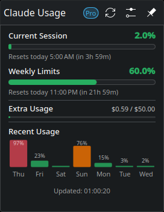

# AI Usage Tracker

A KDE Plasma 6 app that shows how much of your AI coding assistants' usage limits you've used, right in your panel. Install it once and it provides a tracker for each service it supports; add a widget to your panel for each one you use.

| Tracker | Shows | Signs in with |
|---|---|---|
| [Claude](trackers/claude/README.md) | Session and weekly limits, per-model limits, extra (paid) usage | Claude Code CLI |
| [Antigravity](trackers/antigravity/README.md) | Gemini and 3rd-party model quota pools | Antigravity CLI (`agy`) |



## Features

Every tracker has:

- **Panel donut** showing how much of the limit that matters most is used
- **Usage bars** for each limit, with countdowns to when it resets
- **Daily chart** of your peak usage over the last week (optional)
- **Auto-refresh** on an interval you choose, backing off automatically when rate limited
- **Pin popup** to keep the detail view open
- **Colorblind-friendly presets** and custom colors
- **Update notifications** with one-click install — updating from any tracker updates the whole app

## Installation

The app needs KDE Plasma 6 and Python 3 with the `requests` module (`pip install requests`), plus the sign-in tool for each tracker you use (see the table above). One command installs the whole app:

```bash
curl -fsSL https://raw.githubusercontent.com/HuskyDevClub/kde-ai-usage-trackers/main/install-remote.sh | bash
```

Then right-click your panel, select **Add Widgets**, search for **AI Usage Tracker**, and add a widget for each tracker you use.

To install from a clone instead, run `./install.sh` at the top of the repo.

Coming from the separate *Claude Usage Tracker* or *Antigravity Usage Tracker* widgets? Installing or updating replaces them; add the new widgets to your panel once.

## Configuration

Right-click a widget and select **Configure**. Each widget on your panel has its own settings:

| Setting | Default | Description |
|---|---|---|
| Refresh interval | 5 min | How often to fetch fresh data (1–60 min) |
| Show extra usage | On | Show the paid overage section (trackers that report one, like Claude) |
| Show recent usage | Off | Show the daily usage chart |
| Check for updates | On | Check GitHub daily for new releases (manual checks always available) |
| Custom colors | Off | Override theme colors, with colorblind-friendly presets |

## Updating

Every tracker's widget checks GitHub once a day for a new release. When one is available, a notice appears at the top of the widget's popup with an **Update now** button, which downloads the release and upgrades the whole app — followed by a **Restart Plasma** button to apply it. With several widgets on your panel, updating from any one of them is enough.

**Skip** hides the notice until a version newer than the one you skipped is released. Automatic checks can be turned off in each widget's settings.

### Checking manually

Manual checks work whether or not automatic checking is enabled, and always ask GitHub directly rather than reusing the cached daily answer:

- **Check now** in a widget's settings, under **Updates** — the result appears right there, and the widget picks it up too, or
- **Check for Updates** in a widget's right-click menu, which opens the popup with the result

Either way you get an answer: an update notice, *"You're up to date"*, or the reason the check failed. A manual check also un-skips a version you previously skipped.

From a terminal:

```bash
python3 ~/.local/share/plasma/plasmoids/com.github.huskydevclub.kde-ai-usage-trackers.claude/contents/code/check_update.py --force
```

To update manually instead, re-run the install command:

```bash
curl -fsSL https://raw.githubusercontent.com/HuskyDevClub/kde-ai-usage-trackers/main/install-remote.sh | bash
```

### How updates work

Update checks ([check_update.py](core/contents/code/check_update.py)) compare the app's version against the latest GitHub release tag, caching the answer for 24 hours in `~/.local/share/kde-ai-usage-trackers/update.json` — shared by every tracker, so they make one request a day between them and stay well inside GitHub's unauthenticated rate limit. Installing an update ([apply_update.sh](core/contents/code/apply_update.sh)) downloads that release's tarball and runs its `install.sh`, the same script a fresh install uses.

## Uninstallation

```bash
curl -fsSL https://raw.githubusercontent.com/HuskyDevClub/kde-ai-usage-trackers/main/uninstall.sh | bash
```

This removes the whole app: every tracker's widget, the app's data in `~/.local/share/kde-ai-usage-trackers/` (cached usage and daily history), and its icons.

## How it works

Every tracker's widget runs the same engine, in [`core/`](core/). On each refresh it runs the tracker's `fetch_usage.py`, which signs in with the service's own CLI credentials and returns usage in one common shape: limits grouped into bars, a percentage for the panel, and optionally extra usage — see [tracker_common.py](core/contents/code/tracker_common.py). `tracker_common.py` handles everything trackers share: caching, daily history, falling back to the cache when rate limited, and error reporting. The engine draws the panel icon, popup, and settings from that data alone.

The app keeps its data in `~/.local/share/kde-ai-usage-trackers/`: a folder per tracker with its cached usage (shown instantly at startup) and daily history, plus the shared update-check cache.

## Repository layout

```
core/               the app engine: every view, setting, and helper script, plus the
                    app-wide metadata.json (the app's version lives here)
trackers/<name>/    one folder per tracker: metadata.json, contents/code/fetch_usage.py,
                    and a README
build.sh            builds each tracker's Plasma package
install.sh          builds and installs (or upgrades) the whole app
uninstall.sh        removes the whole app
install-remote.sh   downloads the app and runs install.sh
release.sh          tags and publishes a release
```

`build.sh` makes one Plasma package per tracker: `core/` with the tracker's folder laid on top (a tracker file replaces the core file at the same path), and the two `metadata.json` files merged. Neither layer is a complete plasmoid by itself.

### Adding a tracker

1. Create `trackers/<name>/metadata.json` with the tracker's own fields; `core/metadata.json` supplies the rest:

   ```json
   {
       "KPlugin": {
           "Description": "Track your <Name> usage limits and quotas",
           "Icon": "<icon name>",
           "Id": "com.github.huskydevclub.kde-ai-usage-trackers.<name>",
           "Name": "AI Usage Tracker — <Name>"
       },
       "X-Tracker-Name": "<Name>"
   }
   ```

   Add `"X-Tracker-ExtraUsage": true` if its data can include extra (paid) usage, and `"X-Tracker-IconFile"` to install an icon image shipped in the tracker's folder.
2. Add `trackers/<name>/contents/code/fetch_usage.py`: define `fetch()`, returning usage in the common shape described in [tracker_common.py](core/contents/code/tracker_common.py), and end with `run(fetch)`. Raise `TrackerError` for anything to show the user, with `not_logged_in=True` when they need to sign in.
3. Run `./install.sh`. Installing, updating, and uninstalling pick up the new tracker on their own.

## Development

| Command | What it does |
|---|---|
| `./install.sh` | Build every tracker's package and install or upgrade the app |
| `plasmawindowed com.github.huskydevclub.kde-ai-usage-trackers.claude` | Open the installed Claude tracker in a window — no Plasma restart needed (end with `.antigravity` for Antigravity) |
| `./build.sh <dir>` | Build the packages into `<dir>` without installing, to inspect them |
| `ruff check .` | Lint the Python code |
| `./release.sh` | Tag and publish a release — bump `Version` in `core/metadata.json` first |

To try a change, run `./install.sh` and then `plasmawindowed`. The widgets on your panel keep running the old code until Plasma restarts.

## Contributing

Contributions are welcome! Whether it's bug reports, feature requests, or pull requests — every bit helps.

- **Report bugs** — Open an [issue](https://github.com/HuskyDevClub/kde-ai-usage-trackers/issues) and mention which tracker it's about
- **Suggest features** — Have an idea for a useful addition, or a service to track? Let us know
- **Submit pull requests** — Code improvements, UI tweaks, new trackers, and documentation fixes are all appreciated
- **Share feedback** — Let us know how you use the app and what could be better

If you'd like to contribute code, fork the repo, create a branch, and open a PR. There are no strict contribution guidelines — just keep changes focused and test before submitting.

### Releasing

Bump `KPlugin.Version` in `core/metadata.json` — the app's only version number — commit, then run:

```bash
./release.sh --notes "What changed"
```

It tags `v<version>`, marks the release Latest, and publishes it. Don't tag `main` by hand: the tagged commit also carries, at its root, the Claude tracker's package under the widget ID it had before the app existed, so Claude widgets still on v26.3 — whose updater installs the tarball root — can update. `release.sh` builds that for you.

## License

GPL-3.0
